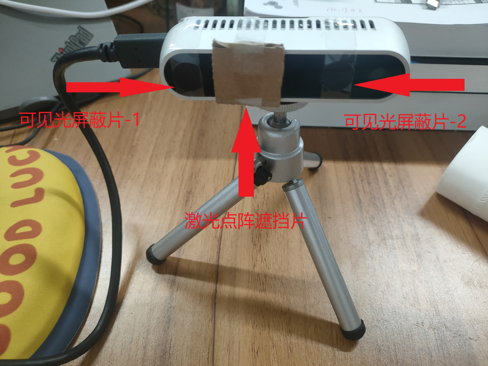
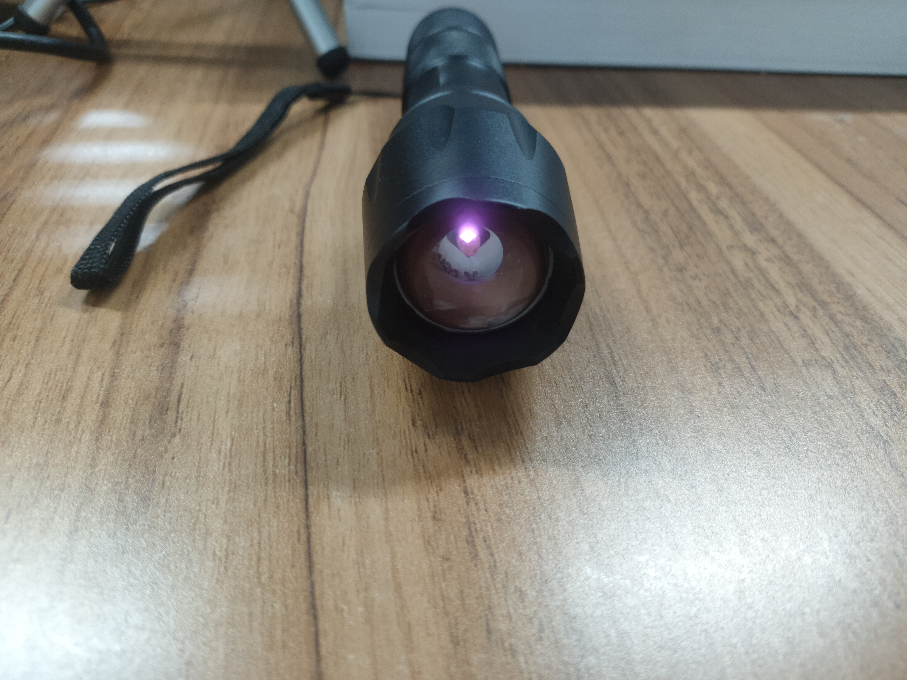
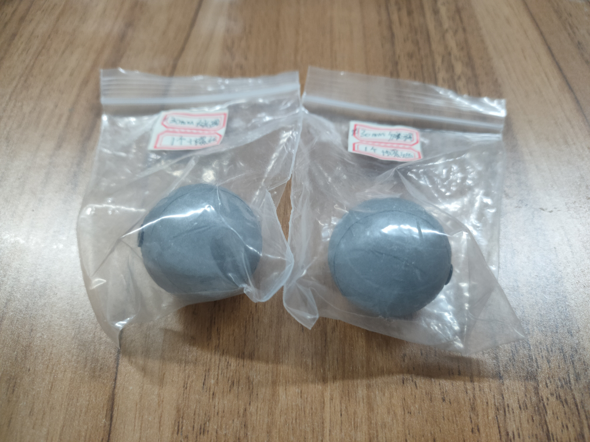

# Realsense_Infrared_Ball_Tracking
## Here is an Infrared-Balls Tracking project based on Intel-Realsense, you will get the 2D, 3D position of the balls.

### Attention!!!
Before you running the program, please make sure you have already connected the realsense, attached the visible light shielding sheet on two infrared cameras, blocked the laser dot matrix and placed diffuse infrared light source.

### Result


### Realsense example




### Environments
```
conda create -n infrare_detection python=3.9
conda activate infrare_detection
pip install -r requirements.txt
```

### Run the Detection
```
python realsens_infrare_rgb.py
```

### Method
We use the infrared camera and bright spot detection to detect the infrared reflective ball

